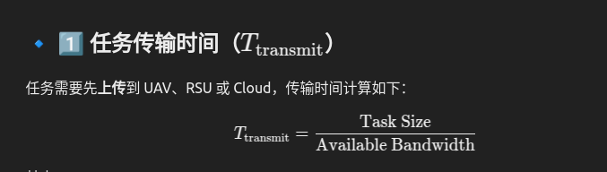
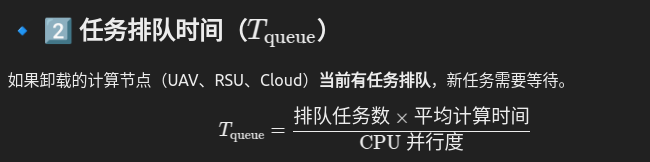
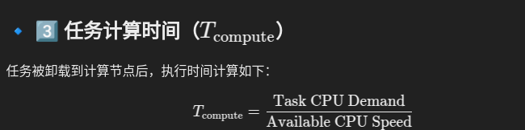

# 任务产生与卸载的过程

源码在task_manager.py中

## 任务产生
每辆车都有一个 任务生成模型（task_profile）
task_profile: {'lambda': 0.5, 'dag_edge_prob': 0.3}
lambda = 0.5 → 任务平均每 2 秒 产生一个（泊松过程）。

具体的函数在
    def _generateTasks(self, task_node_ids_kwardsDict, cur_time, simulation_interval):
    687行

## 任务分配

源码在airfogsim_algorith.py

任务可以分配给
本地
其他的UAV 和U2X
RSU 
cloud server

- 具体分配方式：def transmit_to_Node(self, node_id, trans_data, current_time, fast_return=False):  （task.py   259行）

将数据传输或者返回给nodeid的这个节点（车辆，无人机，路边设施，云服务器），就是简单的进行累加`self._transmitted_size += trans_data`

- 具体分配任务传输路径的方式：def offloadTo(self, node_id, route, time): （task.py   292行）

根据route这个参数设置从当前节点到目标节点的传输路径（列表形式，每个元素是节点 ID）。具体就是改下面例子里的参数：_decided_route 将被设置为 ['nodeA', 'nodeB', 'nodeC']。
_to_offload_route 将被设置为 ['nodeB', 'nodeC']。
_assigned_to 将被设置为 'nodeC'。
_start_to_transmit_time 和 _last_transmission_time 将被设置为 10。

这里面有一行`self._executed_locally = node_id == self._task_node_id`所以任务是理论上可以在本地卸载的（取决于分配算法）

## 任务卸载
具体函数在：
    def offloadTask(self, task_node_id, task_id, target_node_id, current_time, route = None):   881
可以调整配置来控制任务失败的概率

任务在节点上进行计算

- 具体计算方式：def compute(self, allocated_cpu, simulation_interval, current_time):  （task.py   182行）

这个模拟是按照simulation_interval这个步长执行这个compute函数，每次完成`self._computed_size += allocated_cpu * simulation_interval`的计算量

任务的总时间=任务传输时间+任务计算时间+任务等待时间
如果任务的总时间超过了task_deadline就失败